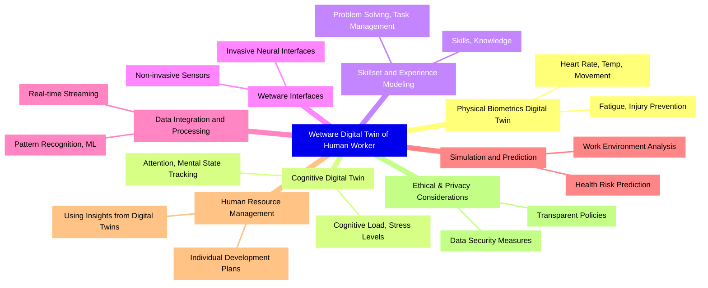

```mermaid
%%{init: {'theme': 'default'}}%%
mindmap
    root["Wetware Digital Twin of Human Worker"]       
        sub1["Physical Biometrics Digital Twin"]
            sub1_1["Heart Rate, Temp, Movement"]
            sub1_2["Fatigue, Injury Prevention"]
        sub2["Cognitive Digital Twin"]
            sub2_1["Cognitive Load, Stress Levels"]
            sub2_2["Attention, Mental State Tracking"]
        sub3["Skillset and Experience Modeling"]
            sub3_1["Skills, Knowledge"]
            sub3_2["Problem Solving, Task Management"]
        sub4["Wetware Interfaces"]
            sub4_1["Non-invasive Sensors"]
            sub4_2["Invasive Neural Interfaces"]
        sub5["Data Integration and Processing"]
            sub5_1["Real-time Streaming"]
            sub5_2["Pattern Recognition, ML"]
        sub6["Simulation and Prediction"]
            sub6_1["Work Environment Analysis"]
            sub6_2["Health Risk Prediction"]
        sub7["Human Resource Management"]
            sub7_1["Using Insights from Digital Twins"]
            sub7_2["Individual Development Plans"]
        sub8["Ethical & Privacy Considerations"]
            sub8_1["Transparent Policies"]
            sub8_2["Data Security Measures"]
```       
